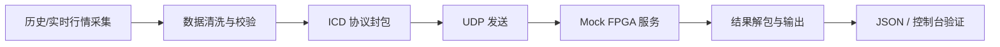
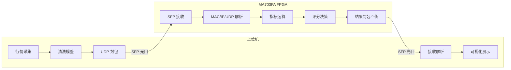

# FPGA_changeProject

基于 Python 的 A 股分钟线与实时行情采集项目，用于 FPGA 高速交易链路联调与数据回放。

这个仓库可以分成两层来理解：

- 当前已经落地的是“上位机 Python 原型链路”
- 远期最终目标是“PC 通过 SFP 光口与 MA703FA FPGA 板卡形成真实闭环”

如果你是第一次看这个项目，先记住一句话：

> 现在它已经能在本地完成 `数据采集 -> 数据校验 -> 协议封包 -> Mock FPGA 回包 -> 结果解析`，之后再把 Mock FPGA 替换成真实 FPGA 光口链路。

## 当前进度

| 模块 | 当前状态 | 说明 |
|---|---|---|
| 历史分钟线采集 | 已完成 | 支持多数据源回退 |
| 3 秒实时采集 | 已完成 | 可生成滑动窗口 JSON |
| 数据标准化/校验 | 已完成 | 已加入字段校验、价格关系校验、时间单调性校验 |
| ICD 协议编解码 | 已完成 | 已按 `ICD V1.0` 与 `数据字典 V1.0` 对齐 |
| UDP 传输层 | 已完成 | 支持超时重试与基础统计 |
| Mock FPGA 回环 | 已完成 | 可本地模拟 FPGA 回包 |
| 端到端验证 | 已完成 | 已可一键跑通非 FPGA 闭环 |
| 上位机可视化界面 | 未完成 | 目前仍以 CLI/JSON 为主 |
| 真实 SFP 光口联调 | 未完成 | 需要真实网卡、光模块、FPGA 板卡 |
| FPGA Verilog 运算/回传 | 未完成 | 属于后续硬件阶段 |

## 最终目标

最终不是停留在 Python 脚本，而是完成下面这条实机链路：

1. 上位机抓取并清洗 K 线数据。
2. 上位机按 ICD 打包为 UDP 数据，通过 SFP 光口发送。
3. FPGA 完成 UDP/IP 解析、技术指标并行计算、决策生成。
4. FPGA 通过 SFP 光口回传结果。
5. 上位机接收解析并做展示、比对和监控。

## 一图看懂当前与最终链路

### 当前可运行链路（已完成）



### 远期最终链路（项目目标）



## 推荐阅读顺序

第一次看代码，建议按这个顺序读：

1. `README.md`
2. `doc/MA703FA_FPGA项目小白百科全书.md`
3. `doc/通信协议接口控制文档 (ICD)/通信协议接口控制文档 (ICD).md`
4. `doc/数据字典/数据字典.md`
5. `config.py`
6. `fetch_history.py`
7. `feed_real_time.py`
8. `run_all.py`
9. `fpga_protocol.py`
10. `udp_transport.py`
11. `mock_fpga.py`
12. `e2e_runner.py`

这样读的原因是：先看“项目想做什么”，再看“协议怎么约定”，最后再看“代码怎么实现”。

## 代码结构速览

| 文件 | 作用 | 小白阅读建议 |
|---|---|---|
| `config.py` | 全局配置中心 | 先看，理解项目运行参数 |
| `fetch_history.py` | 历史分钟线抓取 | 看数据从哪里来 |
| `feed_real_time.py` | 实时 3 秒行情采集 | 看实时数据怎么生成 |
| `run_all.py` | 统一主入口 | 看整个流程如何串起来 |
| `data_validator.py` | 数据校验 | 看数据进入协议前如何兜底 |
| `fpga_protocol.py` | ICD 协议编解码 | 看字节级协议如何实现 |
| `udp_transport.py` | UDP 收发与重试 | 看通信层怎么封装 |
| `mock_fpga.py` | 本地 Mock FPGA | 看硬件回包在软件里如何模拟 |
| `indicators.py` | Python 参考指标 | 看 FPGA 未来要复刻哪些算法 |
| `e2e_runner.py` | 非 FPGA 端到端演示 | 最适合小白直接上手运行 |
| `test_*.py` | 回归测试 | 看每个模块的最小验收标准 |

## 项目结构

```text
.
├─ config.py                              # 全局配置
├─ fetch_history.py                       # 历史分钟线抓取
├─ feed_real_time.py                      # 实时 3 秒采集
├─ run_all.py                             # 主入口：采集 + 可选 UDP 下发
├─ data_validator.py                      # 数据校验
├─ fpga_protocol.py                       # ICD 协议编解码
├─ udp_transport.py                       # UDP 通信与重试
├─ indicators.py                          # Python 参考指标
├─ mock_fpga.py                           # 本地 Mock FPGA 服务
├─ e2e_runner.py                          # 端到端演示脚本
├─ test_modules.py                        # 原始快速测试脚本
├─ test_protocol.py                       # 协议测试
├─ test_validator.py                      # 数据校验测试
├─ test_udp_transport.py                  # UDP 传输测试
├─ test_run_all_protocol.py               # run_all 接入测试
├─ test_contract_snapshot.py              # 契约快照测试
├─ fetch_history.bat                      # Windows 便捷启动脚本
├─ 000858_daily_minute.json               # 示例输出：历史分钟线
├─ 000858_real_time_window.json           # 示例输出：实时滑动窗口
├─ commit.md                              # 提交记录
└─ doc/
  ├─ MA703FA_FPGA项目小白百科全书.md
  ├─ 任务与分工总表.md
  ├─ protocol_contract_v1.json
  ├─ 数据字典.pdf
  ├─ 数据字典/
  │  ├─ 数据字典.md
  │  └─ 数据字典_*.png
  └─ 通信协议接口控制文档 (ICD)/
    ├─ 通信协议接口控制文档 (ICD).md
    └─ 通信协议接口控制文档 (ICD)_*.png
```

## 环境要求

- Windows / Linux / macOS
- Python 3.10+（本仓库已验证 3.10.11）

## 快速开始

### 1) 创建并激活虚拟环境

Windows PowerShell:

```powershell
py -3.10 -m venv .venv
.\.venv\Scripts\Activate.ps1
```

### 2) 安装依赖

```powershell
python -m pip install --upgrade pip
python -m pip install akshare easyquotation requests
```

### 3) 修改配置

编辑 `config.py`：

- `STOCK_LIST`: 股票代码列表
- `OUTPUT_DIR`: 输出目录（不存在会回退到当前目录）
- `REAL_TIME_INTERVAL`: 实时采样间隔（秒）
- `MAX_WINDOW_SIZE`: 滑动窗口条数
- `ENABLE_FPGA_UDP`: 是否开启 UDP 下发
- `FPGA_UDP_HOST` / `FPGA_UDP_PORT`: mock FPGA 或真实 FPGA 地址
- `UDP_TIMEOUT_SECONDS` / `UDP_MAX_RETRIES`: 通信重试参数

### 4) 运行

只拉历史分钟线：

```powershell
python fetch_history.py
```

只跑实时窗口采集：

```powershell
python feed_real_time.py
```

统一运行（推荐）：

```powershell
python run_all.py
```

快速自检：

```powershell
python test_modules.py
```

## 输出数据说明

### 历史分钟线

文件名：`{code}_daily_minute.json`

字段示例：

```json
{
  "time": "2026-05-28 09:31:00",
  "open": 123.45,
  "high": 123.88,
  "low": 123.10,
  "close": 123.66,
  "volume": 987654
}
```

### 实时滑动窗口

文件名：`{code}_real_time_window.json`

字段示例：

```json
{
  "stock_code": "000858",
  "time": "2026-05-28 10:12:15",
  "price": 123.56,
  "volume": 1200,
  "high": 124.02,
  "low": 122.95,
  "open": 123.10,
  "change": 0.78
}
```

## 常见问题

- 非交易时段无数据：脚本会等待开盘时段后重试。
- 接口短时失败：内置重试与多源回退。
- `.venv` 失效：若提示解释器路径不存在，删除 `.venv` 后重新创建。

## 后续建议

- 增加 `requirements.txt` 锁定版本
- 增加日志分级与结构化日志输出
- 增加 JSON schema 校验，保证 FPGA 侧解析稳定

## 非FPGA闭环（今日可跑）

新增模块：

- `fpga_protocol.py`：上/下行帧编解码（48B/44B）+ CRC32
- `data_validator.py`：K线字段、数值范围、时间单调性校验
- `udp_transport.py`：UDP 收发、超时重试、统计计数
- `indicators.py`：Python 参考指标（MA/RSI/MACD/ATR/量比）
- `mock_fpga.py`：本地 UDP Mock FPGA 服务
- `e2e_runner.py`：端到端脚本（读取历史 JSON -> 发包 -> 收包）
- `test_protocol.py`：协议单元测试
- `test_validator.py` / `test_udp_transport.py` / `test_run_all_protocol.py` / `test_contract_snapshot.py`：非FPGA闭环回归测试

快速验证：

```powershell
# 1) 协议单测
python -m unittest -v test_protocol.py

# 2) 完整回归测试
python -m unittest -v test_protocol.py test_validator.py test_udp_transport.py test_run_all_protocol.py test_contract_snapshot.py

# 3) 一键端到端（自动启动 mock）
python e2e_runner.py --code 000858 --start-mock --limit 20
```

说明：

- 当前协议实现已按 ICD V1.0 与数据字典 V1.0 对齐：`0xAA55/0x55AA`、`char[8]` 股票代码、`MA5/MA10/RSI6/RSI14`、`trade_signal/signal_strength`。
- 图片/PDF 已转出为可检索 Markdown：
  - `doc/通信协议接口控制文档 (ICD)/通信协议接口控制文档 (ICD).md`
  - `doc/数据字典/数据字典.md`
- 机器可读契约快照：`doc/protocol_contract_v1.json`
- `run_all.py` 已支持可选 FPGA UDP 下发；相关开关在 `config.py`：`ENABLE_FPGA_UDP`、`FPGA_UDP_HOST`、`FPGA_UDP_PORT`、`UDP_TIMEOUT_SECONDS`、`UDP_MAX_RETRIES`。
- 后续如 ICD 版本升级，可优先修改 `fpga_protocol.py` 的字段映射实现，不影响采集和测试脚本调用方式。

## 许可

仅用于学习与项目研究，行情数据以数据源官方条款为准。
