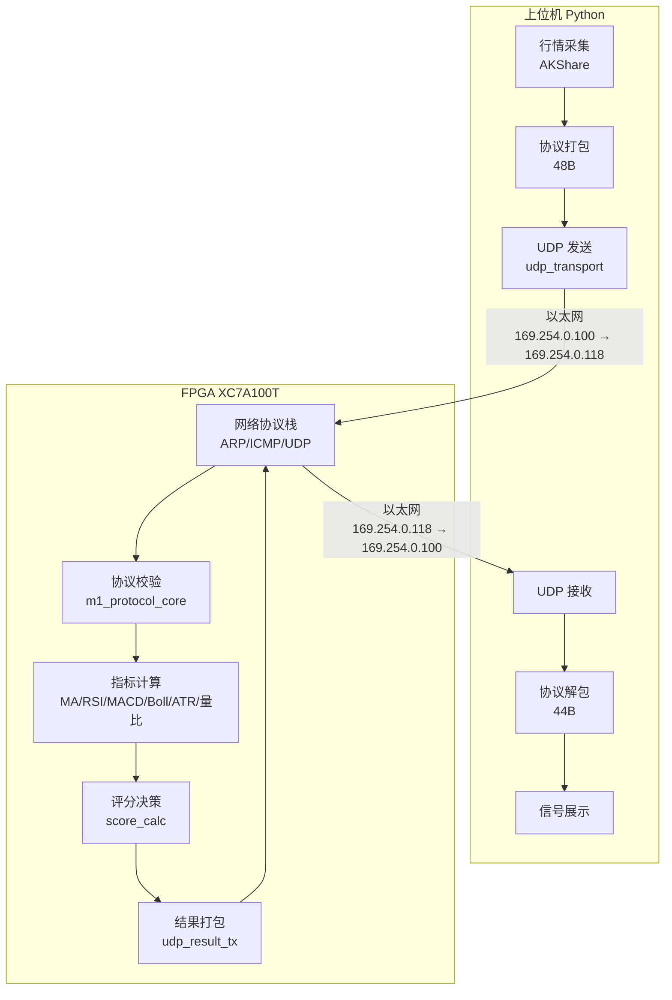

# FPGA Exchange SerDes

> **A 股行情 → FPGA 高速指标计算 → 交易信号回传**

本工程是 Python 上位机与 FPGA RTL 联合系统，目标是完成"行情输入 → 指标计算 → 协议回包/结果输出 → 上位机消费"的闭环。

---

## 🎯 项目亮点

- ✅ **完整网络协议栈**：ARP、ICMP Ping、UDP 全部实现
- ✅ **8 个技术指标并行计算**：MA、RSI、MACD、Bollinger、ATR、量比
- ✅ **亚微秒级延迟**：FPGA 并行计算，延迟固定 20-40ns
- ✅ **完整仿真验证**：12 项 Python 测试 + 6 个 FPGA Testbench

---

## 📊 当前状态（2026-06-03）

| 模块 | 状态 | 说明 |
|------|------|------|
| 协议闭环 | ✅ 稳定 | 48B 上行 → FPGA 校验 → 44B 下行回包 |
| 指标链路 | ✅ 完整 | MA5/20/60、RSI、MACD、Bollinger、ATR、量比 |
| 评分决策 | ✅ 接入 | 0-100 评分 + 0/1/2/3/4 买卖决策 |
| 网络协议栈 | ✅ 实现 | ARP 响应、ICMP Ping、UDP 收发 |
| Python 测试 | ✅ 12/12 | 全部通过 |
| FPGA 仿真 | ✅ 6/6 | 全部 TB 通过 |
| 时序收敛 | ✅ 达标 | WNS ≥ 0，可烧录 |

---

## 🏗️ 系统架构



---

## 📁 目录结构

```text
fpga_exchangeSerdes/
│
├── host_side/                    # Python 上位机
│   ├── app/                      # 主程序
│   │   ├── fpga_protocol.py      # 协议编解码
│   │   ├── udp_transport.py      # UDP 传输层
│   │   ├── e2e_runner.py         # 端到端测试
│   │   ├── mock_fpga.py          # Mock FPGA 服务器
│   │   └── config.py             # 配置文件
│   └── tests/                    # 测试脚本
│       ├── test_protocol.py      # 协议测试
│       └── network_debug.py      # 网络调试工具
│
├── fpga_side/                    # FPGA RTL
│   ├── rtl/
│   │   ├── src/                  # Verilog 源码
│   │   │   ├── top_board.v       # 板级顶层
│   │   │   ├── network_handler.v # 网络协议栈
│   │   │   ├── arp_responder.v   # ARP 响应器
│   │   │   ├── icmp_responder.v  # ICMP Ping 响应器
│   │   │   ├── m1_protocol_core.v # 协议校验核
│   │   │   ├── indicator_top.v   # 指标汇聚
│   │   │   └── score_calc.v      # 评分决策
│   │   ├── tb/                   # Testbench
│   │   └── constraints/          # XDC 约束文件
│   ├── scripts/vivado/           # Vivado 脚本
│   └── logs/                     # 仿真日志
│
├── doc/                          # 项目文档
│   ├── README.md                 # 文档中心
│   ├── 01-快速入门/              # 新人必读
│   ├── 02-设计文档/              # 系统设计
│   ├── 03-技术参考/              # 开发查阅
│   └── 04-开发记录/              # 项目历史
│
└── commit.md                     # 变更记录
```

---

## 🚀 快速开始

### 1. 环境搭建

```powershell
# Python 环境
py -3.10 -m venv .venv
.\.venv\Scripts\Activate.ps1
python -m pip install akshare easyquotation requests

# Vivado 环境
$env:Path = "C:\vivado2019\Vivado\2019.1\bin;" + $env:Path
```

### 2. 运行 Python 测试

```powershell
# 设置环境变量
$env:PYTHONPATH = "host_side/app"

# 运行全部测试（12 项）
python -m unittest -v host_side/tests/test_protocol.py host_side/tests/test_validator.py host_side/tests/test_udp_transport.py host_side/tests/test_run_all_protocol.py host_side/tests/test_contract_snapshot.py host_side/tests/test_mock_fpga_behavior.py
```

### 3. 运行 FPGA 仿真

```powershell
# 单 TB 仿真（推荐）
vivado -mode batch -source fpga_side/scripts/vivado/run_single_tb.tcl -tclargs tb_m1_protocol_core

# 全量仿真
vivado -mode batch -source fpga_side/scripts/vivado/run_xsim.tcl
```

### 4. 构建并烧录

```powershell
# 构建 bitstream
vivado -mode batch -source fpga_side/scripts/vivado/build_bit.tcl -tclargs top_board xc7a100tfgg484-2 8

# 烧录到 FPGA
vivado -mode batch -source fpga_side/scripts/vivado/program_device.tcl
```

### 5. 网络调试

```powershell
# 测试 Ping 连通性
ping 169.254.0.118

# 运行网络调试脚本
python host_side/tests/network_debug.py

# 使用 mock 模式测试
python host_side/app/e2e_runner.py --start-mock --code 000858 --limit 5
```

---

## 🌐 网络配置

| 参数 | FPGA | PC |
|------|------|-----|
| IP 地址 | 169.254.0.118 | 169.254.0.100 |
| 子网掩码 | 255.255.0.0 | 255.255.0.0 |
| UDP 端口 | 5001 (接收) | 5000 (接收) |
| MAC 地址 | 02:00:00:00:00:01 | (自动) |

**重要**：PC 和 FPGA 必须在同一子网（169.254.0.x/16）！

详细配置请参考：[网络配置指南](doc/01-快速入门/network_setup_guide.md)

---

## 📚 文档导航

| 文档 | 说明 | 适合谁 |
|------|------|--------|
| [文档中心](doc/README.md) | 文档总览和导航 | 所有人 |
| [项目百科全书](doc/01-快速入门/MA703FA_FPGAEncyclopedia.md) | **必读！** 30 分钟上手 | 新人 |
| [数据流全图](doc/01-快速入门/dataflow_guide.md) | 一张图看懂系统 | 新人 |
| [网络配置指南](doc/01-快速入门/network_setup_guide.md) | PC 和 FPGA 连接设置 | 所有人 |
| [ICD 协议文档](doc/02-设计文档/通信协议接口控制文档%20(ICD).md) | 帧格式定义（权威） | 开发者 |
| [FPGA 模块设计](doc/02-设计文档/FPGA%20模块详细设计.md) | RTL 模块详解 | FPGA 开发者 |
| [Python 模块设计](doc/02-设计文档/Python%20模块详细设计.md) | 上位机模块详解 | Python 开发者 |

---

## 🔧 技术栈

### FPGA 侧
- **器件**：Xilinx XC7A100T-FGG484-2 (Artix-7)
- **工具**：Vivado 2019.1
- **语言**：Verilog / SystemVerilog
- **接口**：RGMII 千兆以太网

### Python 侧
- **语言**：Python 3.8+
- **依赖**：akshare、easyquotation、requests
- **协议**：UDP Socket

---

## 📈 性能指标

| 指标 | 值 | 说明 |
|------|-----|------|
| 指标计算延迟 | 20-40ns | FPGA 并行计算 |
| UDP 往返延迟 | <1ms | 以太网直连 |
| 支持指标数 | 8 个 | MA、RSI、MACD、Bollinger、ATR、量比 |
| 帧长度 | 上行 48B / 下行 44B | 协议定义 |

---

## 🐛 常见问题

### Q1: Ping 不通 FPGA
**原因**：PC 不在同一子网
**解决**：设置 PC IP 为 169.254.0.100，子网掩码 255.255.0.0

### Q2: Python 模块导入失败
**原因**：未设置 PYTHONPATH
**解决**：`$env:PYTHONPATH = "host_side/app"`

### Q3: Vivado 命令找不到
**原因**：未添加到 PATH
**解决**：`$env:Path = "C:\vivado2019\Vivado\2019.1\bin;" + $env:Path`

### Q4: 时序不收敛
**原因**：组合逻辑过深
**解决**：参考 [时序收敛报告](doc/04-开发记录/timing_convergence_report.md)

---

## 📝 开发工作流

### 修改 Python 代码
1. 修改 `host_side/app/` 中的文件
2. 运行 `python -m unittest -v host_side/tests/test_*.py`
3. 确认全部通过后提交

### 修改 FPGA 代码
1. 修改 `fpga_side/rtl/src/` 中的文件
2. 运行对应 TB：`vivado -mode batch -source fpga_side/scripts/vivado/run_single_tb.tcl -tclargs <tb_name>`
3. 确认 `[TB] PASSED` 后提交

### 修改协议字段
1. 更新 `doc/02-设计文档/通信协议接口控制文档 (ICD).md`
2. 更新 `doc/02-设计文档/数据字典.md`
3. 更新 `host_side/app/fpga_protocol.py`
4. 更新 `fpga_side/rtl/src/m1_protocol_core.v`
5. 运行全部测试确认通过

---

## 📜 许可证

本项目仅供学习和研究使用。

---

## 📞 联系方式

如有问题，请参考：
- [项目百科全书](doc/01-快速入门/MA703FA_FPGAEncyclopedia.md) - 常见问题解答
- [网络配置指南](doc/01-快速入门/network_setup_guide.md) - 网络问题排查
- [时序收敛报告](doc/04-开发记录/timing_convergence_report.md) - 时序优化经验

---

> **💡 提示**：第一次接触这个项目？请从 [项目百科全书](doc/01-快速入门/MA703FA_FPGAEncyclopedia.md) 开始！
