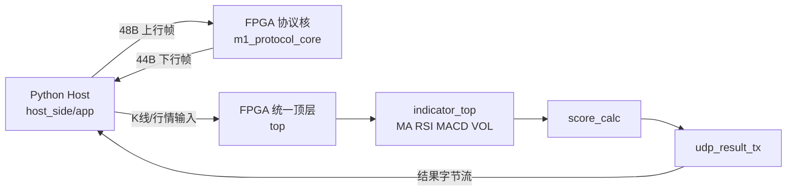

# FPGA Exchange SerDes

本工程是 Python 上位机与 FPGA RTL 联合系统，目标是完成“行情输入 -> 指标计算 -> 协议回包/结果输出 -> 上位机消费”的闭环。

## 1. 当前状态

- 上位机协议与校验链路可运行
- FPGA 协议核 `m1_protocol_core` 可运行
- FPGA 指标与评分链路 `top + indicator_top + score_calc + udp_result_tx` 可运行
- 系统级接线已完成：协议核与指标链路在 `top` 内实连

## 2. 系统架构



## 3. 目录结构

```text
.
├─ host_side/
│  ├─ app/      # Python 主逻辑
│  ├─ tests/    # Python 测试
│  └─ data/     # 样例数据/输出
├─ fpga_side/
│  ├─ rtl/      # Verilog + TB + 约束 + 仿真工程
│  ├─ scripts/  # Vivado 批脚本
│  ├─ logs/     # 仿真与运行日志
│  └─ docs/     # FPGA 文档入口
├─ doc/         # 项目总文档（架构/接口/数据）
└─ commit.md    # 变更记录
```

## 4. 快速开始

### 4.1 Python 依赖与测试

```powershell
py -3.10 -m venv .venv
.\.venv\Scripts\Activate.ps1
python -m pip install --upgrade pip
python -m pip install akshare easyquotation requests

$env:PYTHONPATH="host_side/app"
python -m unittest -v host_side/tests/test_protocol.py host_side/tests/test_validator.py host_side/tests/test_udp_transport.py host_side/tests/test_run_all_protocol.py host_side/tests/test_contract_snapshot.py host_side/tests/test_mock_fpga_behavior.py
```

### 4.2 FPGA 批仿真

```powershell
$env:Path="C:\vivado2019\Vivado\2019.1\bin;" + $env:Path
vivado -mode batch -source fpga_side/scripts/vivado/run_xsim.tcl
```

### 4.3 单 TB 独立批跑

```powershell
vivado -mode batch -source fpga_side/scripts/vivado/run_single_tb.tcl -tclargs tb_top
```

## 5. 文档阅读顺序

1. doc/README.md
2. doc/MA703FA_FPGAEncyclopedia.md（小白百科全书，含 Vivado 操作步骤）
3. doc/系统总体架构设计.md
4. doc/产品需求说明书 (PRD).md
5. doc/通信协议接口控制文档 (ICD).md
6. doc/数据字典.md
7. doc/FPGA 模块详细设计.md
8. doc/Python 模块详细设计.md

## 6. 闭环验证（2026-05-31）

- 已执行：`tb_m1_protocol_core`、`tb_system_mixed`、`tb_top`
- 三项 TB 均完成 compile/elaborate/simulate
- 结果日志位于 `fpga_side/logs/tb_runs_20260531/`

## 7. 常见问题

### Q1: Vivado 找不到
确认路径为 `C:\vivado2019\Vivado\2019.1\bin`。

### Q2: Python 模块导入失败
先设置 `PYTHONPATH=host_side/app`。
