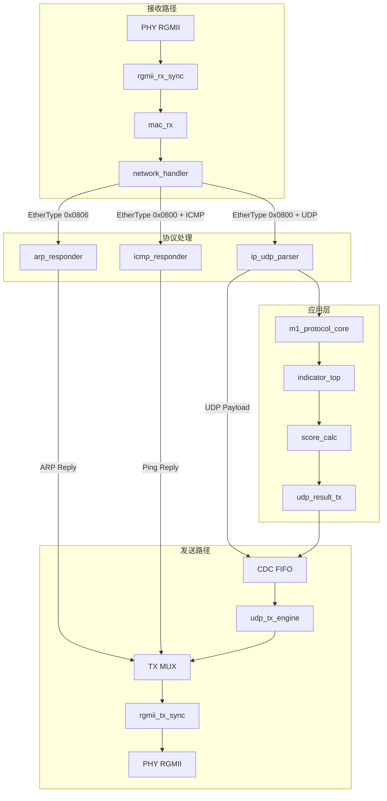
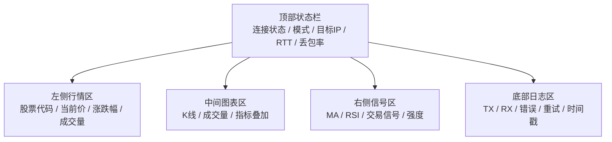

# MA703FA FPGA 项目小白百科全书（2026-05 最新版）

## 0. 这份文档解决什么问题

读完本文档，你可以独立完成四件事：

1. 在自己的电脑上搭建 Python + Vivado 2019 环境
2. 跑通上位机 12 项协议测试（不需要 FPGA 硬件）
3. 在 Vivado 2019 里从零建工程、加文件、跑仿真、看波形
4. 看懂系统闭环，知道改代码该改哪里、改了之后该跑什么回归
5. 完成 FPGA 实机烧录，让 FPGA 真正作为高速交易系统的一部分承担运算任务

---

## 1. 三条红线（先看完再动手）

1. **协议不乱改**：上行 48B、下行 44B、Big-Endian、CRC32。任何字段变动必须先改 ICD 和数据字典。
2. **先验证再改代码**：先跑现有测试确认基线通过，再做修改，最后跑回归。
3. **改接口必须同步文档**：ICD、数据字典、Python/FPGA 协议实现、测试，四个一起更新。

---

## 2. 这个项目在做什么

把 A 股行情数据（open/high/low/close/volume）从 Python 上位机通过 UDP 发送给 FPGA，FPGA 硬件并行计算 MA/RSI/MACD/量比/Bollinger/ATR 等指标并打分，然后把结果打包回传给上位机展示交易信号。

**当前进展（2026-06-03）**：
- 协议闭环稳定（48B 上行 → FPGA 校验 → 44B 下行回包）
- 指标链路完整（MA5/MA20/MA60、RSI、MACD(DIF/DEA)、Bollinger、ATR、量比）
- 评分决策链路接入（0-100 评分 + 0/1/2 买卖决策）
- Python 12/12 测试通过，FPGA 6 个 TB 全部跑通
- **网络协议栈完整**：ARP 响应、ICMP Ping、UDP 收发全部实现
- **PC-FPGA 网络连通性问题已修复**：IP 子网配置、ARP 响应器、ICMP 响应器

---

## 3. 目录一览

```text
fpga_exchangeSerdes/
├─ host_side/
│  ├─ app/                # Python 主代码（协议、校验、传输、编排）
│  │   ├─ fpga_protocol.py    ← 协议编解码（最核心）
│  │   ├─ data_validator.py   ← 数据校验
│  │   ├─ udp_transport.py    ← UDP 收发
│  │   ├─ mock_fpga.py        ← 本地模拟 FPGA
│  │   ├─ e2e_runner.py       ← 端到端流程
│  │   ├─ run_all.py          ← 一键执行
│  │   └─ config.py           ← 网络/超时配置
│  ├─ tests/              # Python 测试（8 个文件，12+ 项）
│  │   ├─ test_protocol.py
│  │   ├─ test_validator.py
│  │   ├─ test_udp_transport.py
│  │   ├─ test_run_all_protocol.py
│  │   ├─ test_contract_snapshot.py
│  │   ├─ test_mock_fpga_behavior.py
│  │   └─ network_debug.py    ← 网络调试工具（新增）
│  └─ data/               # 样例数据
├─ fpga_side/
│  ├─ rtl/
│  │   ├─ src/            # Verilog 源码（含板级与算法级顶层）
│  │   │   ├─ top_board.v     ← 板级综合/烧录顶层（当前实机主入口）
│  │   │   ├─ top.v           ← 算法/协议逻辑顶层
│  │   │   ├─ network_handler.v ← 网络协议处理器（新增）
│  │   │   ├─ arp_responder.v ← ARP 响应器（新增）
│  │   │   ├─ icmp_responder.v ← ICMP Ping 响应器（新增）
│  │   │   ├─ board_eth_bridge.v ← 以太网桥接（已更新）
│  │   │   ├─ m1_protocol_core.v ← 协议校验核
│  │   │   ├─ indicator_top.v ← 指标汇聚
│  │   │   ├─ ma_calc.v       ← 均线 MA
│  │   │   ├─ rsi_calc.v      ← 相对强弱 RSI
│  │   │   ├─ macd_calc.v     ← MACD
│  │   │   ├─ vol_ratio_calc.v ← 量比
│  │   │   ├─ score_calc.v    ← 综合评分
│  │   │   └─ udp_result_tx.v ← 结果帧打包发送
│  │   └─ tb/             # 仿真 Testbench（6 个）
│  │       ├─ tb_top.v        ← 协议核专项（模块名 tb_m1_protocol_core）
│  │       ├─ tb_top.sv       ← 顶层联调
│  │       ├─ tb_system_mixed.v ← 好帧/坏帧混合压力
│  │       ├─ tb_indicator_top.sv
│  │       ├─ tb_score_calc.sv
│  │       └─ tb_udp_result_tx.sv
│  ├─ scripts/vivado/    # Vivado TCL 批处理脚本
│  │   ├─ run_single_tb.tcl  ← 单 TB 独立执行（推荐）
│  │   ├─ run_xsim.tcl       ← 批量执行所有 TB
│  │   ├─ build_bit.tcl      ← 一键综合/实现/报告/bit
│  │   └─ program_device.tcl ← 一键连接硬件并下载最新 bit
│  └─ logs/              # 仿真输出日志
└─ doc/                  # 项目文档（14 份）
    ├─ 产品需求说明书 (PRD).md
    ├─ 通信协议接口控制文档 (ICD).md    ← 协议字段定义（权威来源）
    ├─ 数据字典.md
    ├─ 系统总体架构设计.md
    ├─ FPGA 模块详细设计.md
    ├─ Python 模块详细设计.md
    ├─ network_setup_guide.md ← 网络配置指南（新增）
    └─ protocol_contract_v1.json
```

---

## 4. 环境搭建（第一步，必须完成）

### 4.1 Python 环境

```powershell
# 1. 确认 Python 版本 ≥ 3.8
python --version

# 2. 创建虚拟环境（推荐）
py -3.10 -m venv .venv
.\.venv\Scripts\Activate.ps1

# 3. 安装依赖
python -m pip install --upgrade pip
python -m pip install akshare easyquotation requests

# 4. 验证导入
python -c "import akshare; print('AKShare OK')"
python -c "import struct; print('struct OK')"
```

### 4.2 Vivado 2019 环境

**安装要求**：Vivado 2019.1，安装路径 `C:\vivado2019\Vivado\2019.1\`

**验证安装**（打开 PowerShell）：
```powershell
# 添加 Vivado 到 PATH
$env:Path = "C:\vivado2019\Vivado\2019.1\bin;" + $env:Path

# 验证 vivado 命令可用
vivado -version
# 应输出类似: Vivado v2019.1 (64-bit)
```

> **注意**：如果 Vivado 装在别的位置，请替换路径。后续所有命令中 `C:\vivado2019\Vivado\2019.1\bin` 都要替换为你的实际路径。

---

## 5. Python 侧：手把手跑通全部测试

### 5.1 设置环境变量

**每次打开新终端都要先执行这一行**：
```powershell
$env:PYTHONPATH = "host_side/app"
```

> **踩坑提示**：如果忘了设置 PYTHONPATH，会遇到 `ModuleNotFoundError: No module named 'fpga_protocol'`。

### 5.2 跑一个测试试试水

```powershell
python -m unittest -v host_side/tests/test_protocol.py
```

**预期看到**：
```
test_build_upstream_frame ... ok
test_parse_downstream_frame ... ok
test_crc32_consistency ... ok
...
----------------------------------------------------------------------
Ran X tests in 0.XXXs
OK
```

### 5.3 一键跑完所有测试

```powershell
python -m unittest -v host_side/tests/test_protocol.py host_side/tests/test_validator.py host_side/tests/test_udp_transport.py host_side/tests/test_run_all_protocol.py host_side/tests/test_contract_snapshot.py host_side/tests/test_mock_fpga_behavior.py
```

**验收标准**：输出末尾出现 `OK`，且所有测试用例都显示 `ok`（共 12 项）。

### 5.4 每个测试在测什么

| 测试文件 | 验证内容 | 不通过意味着 |
|----------|----------|-------------|
| `test_protocol.py` | 48B 上行帧打包、44B 下行帧解包、CRC32 | 协议实现有 bug |
| `test_validator.py` | 数据校验规则（缺失值、异常值） | 数据过滤逻辑有问题 |
| `test_udp_transport.py` | UDP 收发、超时、重试 | 传输层有问题 |
| `test_run_all_protocol.py` | 主流程协议连通 | 端到端路径不通 |
| `test_contract_snapshot.py` | 协议快照一致性 | 协议契约 JSON 与实现不一致 |
| `test_mock_fpga_behavior.py` | mock FPGA 行为与异常路径 | mock 模拟不准确 |

---

## 6. FPGA 侧：Vivado 2019 操作手把手教程

当前仓库建议固定使用两条路线，不要混用：

1. 路线 A（仿真验证流）：`run_single_tb.tcl` / `run_xsim.tcl`
2. 路线 B（可烧录验证流）：`build_bit.tcl` -> `program_device.tcl`

其中，路线 A 用于改 RTL 后快速回归；路线 B 用于上板前签核与下载。

---

### 6.1 路线 A：GUI 仿真验证流（新人必做，理解工程结构）

以下步骤在 Vivado 2019 GUI 中完成。**每个菜单名、按钮名都是准确的，请逐字对照。**

#### 步骤 1：启动 Vivado

```powershell
$env:Path = "C:\vivado2019\Vivado\2019.1\bin;" + $env:Path
vivado
```

Vivado 启动后会显示 Welcome 界面。

#### 步骤 2：创建新工程

1. 在 Welcome 界面点击 **"Create Project"**
2. 弹出向导，点击 **Next >**
3. **Project name**：填 `fpga_exchange_serdes_xsim`（或任意名字）
4. **Project location**：点 `...` 浏览，选到 `fpga_side/rtl/sim/` 目录
5. 勾选 **"Create project subdirectory"** → 点击 **Next >**
6. Project Type：选 **"RTL Project"**，**不要**勾选 "Do not specify sources at this time" → Next >
7. **Add Sources** 页面：点击绿色的 **"+"** 按钮 → **"Add Files"**
   - 浏览到 `fpga_side/rtl/src/`
   - 全选所有 `.v` 文件（建议直接全选当前目录下全部）
   - 点击 **OK** → 确认 "Copy sources into project" **不勾选**（保持原位引用）
   - 确认 Target language 是 **Verilog**，Simulator language 是 **Mixed**
   - 点击 **Next >**
8. **Add Constraints** 页面：
   - 如果你当前只做仿真：可以先 **Next >** 跳过。
   - 如果你后续要上板烧录：这里必须加入 `.xdc` 约束文件（管脚、电平、时钟约束），否则 bitstream 即使生成也大概率无法在板上正常工作。
9. **Default Part** 页面：
   - 在搜索框输入 `xc7a100tfgg484-2`
   - 选中搜索结果 → 点击 **Next >**
10. 最后点击 **Finish**，等待工程创建完成。

#### 步骤 3：添加仿真源文件（Testbench）

1. 在左侧 **Flow Navigator** 中，找到 **PROJECT MANAGER** 组
2. 点击 **"Add Sources"**（或菜单 File → Add Sources）
3. 选择 **"Add or create simulation sources"** → Next >
4. 点击绿色的 **"+"** → **"Add Files"**
   - 浏览到 `fpga_side/rtl/tb/`
   - 全选所有 `.v` 和 `.sv` 文件（共 6 个）
   - 点击 **OK**
   - 确认 **"Copy sources into project"** 不勾选
5. 点击 **Finish**

#### 步骤 4：选择仿真顶层并启动仿真

以 `tb_m1_protocol_core` 为例（协议核专项测试）：

1. 在左侧 **Flow Navigator** 中，点击 **SIMULATION** 组下的 **"Run Simulation"** → **"Run Behavioral Simulation"**
2. Vivado 会开始编译（elaborate），等待约 1-3 分钟
3. 如果弹出 "No valid simulation top module" 错误：
   - 在 **Sources** 窗口中（左侧 Project Manager 下方），切换到 **"Simulation Sources"** 标签
   - 展开 `sim_1`，找到 `tb_m1_protocol_core`（在 `tb_top.v` 里）
   - 右键点击 → **"Set as Top"**
   - 再次 Run Simulation
4. 编译通过后，仿真窗口自动打开，波形界面出现。

#### 步骤 5：运行仿真

1. 在仿真工具栏（顶部）找到运行控制按钮：
   - **"Run All"**（蓝色三角形 + 竖线）：一直跑到 `$finish` 止
   - **"Run For..."**：指定时长运行
2. 点击 **"Run All"**，等待仿真完成（通常几秒到几十秒）
3. 仿真结束后检查 **Tcl Console**（底部面板）的输出：
   ```
   [CASE] normal
   [CASE] bad_header
   [CASE] bad_length
   [CASE] bad_crc
   [TB] PASSED
   ```
   看到 `[TB] PASSED` 即表示通过。

#### 步骤 6：查看波形（调试用）

1. 在仿真完成后，波形窗口保留所有信号的历史值
2. 在 **Scope** 子窗口（左侧）展开 `dut`（即 UUT/DUT 实例）
3. 将关键信号拖到波形窗口：
   - `rx_valid`, `rx_data`, `rx_last`（上行帧输入）
   - `tx_valid`, `tx_data`, `tx_last`（下行帧输出）
   - `frame_accepted`, `frame_rejected`, `frame_reject_reason`（协议核状态）
4. 用鼠标滚轮缩放时间轴，检查帧时序

#### 步骤 7：更换 Testbench 重跑

1. 关闭当前仿真：File → **"Close Simulation"**
2. 在 **Sources** → **Simulation Sources** → `sim_1` 中找到另一个 TB
   - 例如 `tb_top`（在 `tb_top.sv` 中）或 `tb_system_mixed`（在 `tb_system_mixed.v` 中）
3. 右键 → **"Set as Top"**
4. 重新点击 **"Run Simulation"** → **"Run Behavioral Simulation"**

#### 步骤 8：关闭工程

仿真完成后，File → **"Close Project"**。

---

### 6.2 路线 A：批处理仿真流（日常回归）

配置好环境变量后，一行命令跑一个 TB：

```powershell
# 先设置 Vivado 路径
$env:Path = "C:\vivado2019\Vivado\2019.1\bin;" + $env:Path

# 逐个执行（推荐用于排障）
vivado -mode batch -source fpga_side/scripts/vivado/run_single_tb.tcl -tclargs tb_m1_protocol_core
vivado -mode batch -source fpga_side/scripts/vivado/run_single_tb.tcl -tclargs tb_system_mixed
vivado -mode batch -source fpga_side/scripts/vivado/run_single_tb.tcl -tclargs tb_top
vivado -mode batch -source fpga_side/scripts/vivado/run_single_tb.tcl -tclargs tb_indicator_top
vivado -mode batch -source fpga_side/scripts/vivado/run_single_tb.tcl -tclargs tb_score_calc
vivado -mode batch -source fpga_side/scripts/vivado/run_single_tb.tcl -tclargs tb_udp_result_tx
```

每个命令执行完毕后，检查终端输出末尾是否有：
```
single tb done: tb_xxxxx
```

**脚本做了什么**（`run_single_tb.tcl` 每步说明）：
1. 在 `fpga_side/rtl/sim/` 下创建独立工程（工程名带 TB 名后缀）
2. 自动收集 `fpga_side/rtl/src/*.v` 所有源文件
3. 自动收集 `fpga_side/rtl/tb/*.v` 和 `*.sv` 所有 TB 文件
4. 设置你指定的 TB 为仿真顶层
5. 启动 behavioral simulation，编译并运行
6. 仿真结束后关闭工程

### 6.3 路线 B：GUI 可烧录验证流（综合->实现->时序->bit）

这条流程用于回答“是否可上板烧录”。

1. 打开工程后，确认顶层模块是 `top_board`。
2. Add Sources -> Add or create constraints，加入 `fpga_side/rtl/constraints/*.xdc`。
3. 运行 Run Synthesis。
4. 运行 Run Implementation。
5. 查看 Report DRC、Report Timing Summary、Report Clock Interaction。
6. 只有时序和 DRC 通过后，执行 Generate Bitstream。

可烧录判定最小标准：

1. WNS >= 0
2. TNS = 0
3. 无阻塞级 DRC 错误
4. bit 文件成功生成

### 6.4 路线 B：批处理烧录流（推荐实际执行）

推荐固定按下面顺序执行，不要跳步：

```powershell
# 1) 构建并导出报告
vivado -mode batch -source fpga_side/scripts/vivado/build_bit.tcl -tclargs top_board xc7a100tfgg484-2 8

# 2) 下载最新 bit 到首个检测到的器件
vivado -mode batch -source fpga_side/scripts/vivado/program_device.tcl
```

VS Code 中对应任务：

1. `Vivado: build bitstream (top_board)`
2. `Vivado: program device (latest bit)`

---

### 6.5 六个 TB 都在测什么

| TB 文件 | 仿真顶层 | 测试场景 | 期望结果 |
|---------|----------|----------|----------|
| `tb_top.v` | `tb_m1_protocol_core` | 正常帧 + 坏 header + 坏 length + 坏 CRC | `[TB] PASSED` |
| `tb_system_mixed.v` | `tb_system_mixed` | 好帧、坏帧混合压力 | 接受/拒绝计数正常 |
| `tb_top.sv` | `tb_top` | 顶层全链路（指标→评分→打包） | heartbeat=1, score 有值 |
| `tb_indicator_top.sv` | `tb_indicator_top` | 指标汇聚链路输出 | 各指标值非零 |
| `tb_score_calc.sv` | `tb_score_calc` | 评分与决策映射 | score=46, decision=2 |
| `tb_udp_result_tx.sv` | `tb_udp_result_tx` | 打包字节流行为 | valid_bytes=60 |

---

## 7. 闭环数据流（看懂这张图就懂了整个项目）


关键路径：
1. **上行**：Python 取行情 → 校验 → 协议打包（48B）→ UDP 发送
2. **FPGA 处理**：协议校验（header/length/crc）→ 指标计算 → 评分 → 打包（44B）
3. **下行**：UDP 回传 → Python 解包 → 展示交易信号

---

## 7.1 网络协议栈（2026-06-03 新增）

FPGA 现在实现了完整的网络协议栈，支持 ARP、ICMP、UDP 三种协议。

### 网络协议栈架构



### 新增模块说明

#### network_handler.v
- **职责**：网络协议栈顶层处理器
- **功能**：
  - 捕获以太网头（14 字节）
  - 根据 EtherType 分发到不同协议处理器
  - TX 多路复用（优先级：ARP > ICMP > UDP）
- **接口**：
  - RX：来自 mac_rx 的字节流
  - TX：发送到 rgmii_tx_sync 的字节流
  - UDP Payload：与应用层交互

#### arp_responder.v
- **职责**：响应 ARP 请求
- **功能**：
  - 检测 ARP 请求（opcode = 0x0001）
  - 验证目标 IP 是否为本机 IP
  - 构造 ARP 响应（包含本机 MAC 地址）
  - 计算 FCS（CRC32）
- **配置参数**：
  - `LOCAL_MAC`：本机 MAC 地址（默认 02:00:00:00:00:01）
  - `LOCAL_IP`：本机 IP 地址（默认 169.254.0.118）

#### icmp_responder.v
- **职责**：响应 ICMP Ping 请求
- **功能**：
  - 检测 ICMP Echo Request（type = 8）
  - 验证目标 IP 是否为本机 IP
  - 存储 ICMP payload（最多 256 字节）
  - 构造 ICMP Echo Reply
  - 计算 IP 头校验和
- **用途**：测试网络连通性，方便调试

### 网络配置要求

| 参数 | FPGA 端 | PC 端 |
|------|---------|-------|
| IP 地址 | 169.254.0.118 | 169.254.0.100 |
| 子网掩码 | 255.255.0.0 | 255.255.0.0 |
| MAC 地址 | 02:00:00:00:00:01 | (自动) |
| UDP 端口 | 5001 (接收) / 5000 (发送) | 5000 (接收) / 5001 (发送) |

**重要**：PC 和 FPGA 必须在同一子网（169.254.0.x/16）！

### 网络调试命令

```bash
# 测试 Ping 连通性
ping 169.254.0.118

# 检查 ARP 表
arp -a

# 运行网络调试脚本
python host_side/tests/network_debug.py

# 使用 Wireshark 抓包
# 过滤器: udp port 5001 or udp port 5000 or arp
```

---

## 8. 实机验证：烧录、联机、上位机展示

这一节讲的是“真正把 FPGA 放进系统里干活”，不是只跑仿真。目标很明确：先把 bitstream 烧录到板子上，再让上位机持续发行情帧，FPGA 负责完成协议校验、指标计算和信号打分，最后在上位机和网页上看到有意义的输入输出展示。

### 8.1 实机验证的最小闭环

实机验证不是先追求花哨界面，而是先把这条链跑通：


你需要看到的不是“有回包”这么简单，而是下面这三件事同时成立：

1. 上位机发出去的输入是合理的，股票代码、时间戳、OHLCV 都正常。
2. FPGA 回来的输出是合理的，MA、RSI、交易信号、强度都在可解释范围内。
3. 网页展示能把输入、输出、状态、历史趋势放在同一个界面里，方便你盯盘和排障。

### 8.2 实机烧录前先确认什么

烧录之前，先确认这几项：

1. Vivado 2019 安装正常，命令行可以启动。
2. 板卡已正确连接 JTAG，供电正常。
3. 以太网线连接到 FPGA 口，主机 IP 是 `192.168.100.104`，FPGA 目标 IP 是 `169.254.0.118`。
4. 上位机配置里 `FPGA_UDP_MODE = "real"`，并且 `ENABLE_FPGA_UDP = True`。
5. 你已经能跑通至少一次仿真，确认 RTL 逻辑没问题。
6. `fpga_side/rtl/constraints/` 目录中已经准备好板级 `.xdc` 约束文件（至少包含时钟管脚、复位管脚、UDP/GMII/RGMII 相关 IO 管脚和 IOSTANDARD）。

> 关键提醒：仿真可以不依赖约束文件，但实机烧录必须依赖约束文件。没有正确的 `.xdc`，你会遇到“能烧录但不工作”或“实现阶段失败”的典型问题。

### 8.2.1 约束文件最小清单（实机必须）

在实机模式下，建议把约束按下面最小清单补齐：

1. 主时钟：`PACKAGE_PIN`、`IOSTANDARD`、`create_clock`。
2. 复位信号：管脚、电平定义（必要时加上下拉/上拉）。
3. 以太网接口相关 IO：TX/RX、控制信号、时钟信号的管脚与电平。
4. 关键异步时钟组：必要时添加 `set_clock_groups -asynchronous`。
5. 外设状态/调试 IO（如 LED）：用于快速判断板上状态。

约束文件建议放在：`fpga_side/rtl/constraints/board_real.xdc`

可用的骨架示例（管脚名需按你的开发板手册替换）：

```tcl
## Clock
set_property PACKAGE_PIN <CLK_PIN> [get_ports sys_clk]
set_property IOSTANDARD LVCMOS33 [get_ports sys_clk]
create_clock -period 10.000 -name sys_clk -waveform {0.000 5.000} [get_ports sys_clk]

## Reset
set_property PACKAGE_PIN <RST_PIN> [get_ports rst_n]
set_property IOSTANDARD LVCMOS33 [get_ports rst_n]

## Example Ethernet IO (replace with your board pinout)
set_property PACKAGE_PIN <ETH_TXD0_PIN> [get_ports eth_txd[0]]
set_property IOSTANDARD LVCMOS33 [get_ports eth_txd[0]]

set_property PACKAGE_PIN <ETH_RXD0_PIN> [get_ports eth_rxd[0]]
set_property IOSTANDARD LVCMOS33 [get_ports eth_rxd[0]]
```

### 8.3 Vivado 实机烧录手把手步骤

下面是把 FPGA 真正变成系统运算单元的推荐流程。这里以 Vivado 2019 为例，步骤尽量按按钮顺序写。

#### 步骤 1：打开工程

1. 启动 Vivado 2019。
2. 打开已有工程，或者按仿真章节的方法创建工程。
3. 确认顶层是 `top_board.v`（对应模块 `top_board`），不是测试平台 `tb_*`。

#### 步骤 1.5：先把约束文件加进工程（实机烧录必做）

1. 在 **Flow Navigator** 中点击 **Add Sources**。
2. 选择 **Add or create constraints**。
3. 点击 **Add Files**，选中 `fpga_side/rtl/constraints/*.xdc`。
4. 在 **Constraints** 视图检查是否已被识别到 `constrs_1`。
5. 若有多个 `.xdc`，确认当前实机用的是板卡对应版本，避免混用。

#### 步骤 2：切到综合/实现流程

1. 在左侧 Flow Navigator 里找到 **SYNTHESIS**。
2. 点击 **Run Synthesis**。
3. 通过后点击 **Run Implementation**。
4. 如果实现失败，先看约束、时钟、端口名是否和顶层一致。

#### 步骤 3：生成 bitstream

1. 实现完成后点击 **Generate Bitstream**。
2. 等待 Vivado 生成 `.bit` 文件。
3. 如果报错，优先看时序收敛、端口约束和综合警告。

#### 步骤 4：连接硬件并烧录

1. 用 JTAG 线连接开发板和电脑。
2. 打开 **Open Hardware Manager**。
3. 点击 **Open Target** → **Auto Connect**。
4. 选择目标器件。
5. 右键目标器件，选择 **Program Device**。
6. 在弹窗里选中刚生成的 `.bit` 文件，确认后开始烧录。

#### 步骤 5：上电联机检查

1. 烧录成功后，确认 FPGA 端口状态正常。
2. 在上位机上启动实机模式。
3. 持续发送几条行情帧，观察回包是否稳定。
4. 如果板卡上有 LED、状态灯或 ILA，确认它们和协议状态一致。

### 8.3.1 可烧录性验证全流程（综合 -> 实现 -> 时序 -> bit）

这一节是实操版标准流程，目标是回答一个问题：

"这份工程现在能不能安全上板烧录？"

你需要按顺序完成四个阶段，每个阶段都有明确通过标准。

#### 阶段 A：综合（Run Synthesis）

GUI 路径：
1. 左侧 Flow Navigator -> SYNTHESIS -> Run Synthesis
2. 结束后点 Open Synthesized Design
3. 打开 Reports -> Report Utilization

检查项：
1. 无 Critical Warning 对应到顶层端口缺失/位宽错连。
2. 资源占用（LUT/FF/BRAM/DSP）没有明显异常突增。
3. 顶层必须是 top_board（不是 tb_*）。

不通过时优先排查：
1. 顶层误设成 testbench。
2. 新增 RTL 文件未加入 sources_1。
3. 端口名与 XDC 约束不一致。

#### 阶段 B：实现（Run Implementation）

GUI 路径：
1. Flow Navigator -> IMPLEMENTATION -> Run Implementation
2. 结束后点 Open Implemented Design
3. 先看 Report DRC，再看时序总结

检查项：
1. DRC 无阻塞级错误（如 NSTD/UCIO/电压冲突）。
2. IO Bank 电压与 IOSTANDARD 一致。
3. 未出现关键布线失败（Place/Route failed）。

不通过时优先排查：
1. XDC 中 pin 或 IOSTANDARD 写错。
2. 多个约束文件重复约束同一端口。
3. 板级引脚与工程顶层端口名称不一致。

#### 阶段 C：时序检查（Timing Signoff）

在 implemented design 里执行：
1. Reports -> Report Timing Summary
2. Reports -> Report Clock Interaction
3. Reports -> Report CDC（若可用）

最小通过标准：
1. WNS >= 0.000 ns
2. TNS = 0.000 ns
3. 无未约束关键路径（Unconstrained paths 为 0，或确认仅为无害测试路径）
4. 跨时钟域路径已通过异步时钟组或 CDC 结构正确隔离

当前工程重点关注时钟域：
1. sys_clk_50m
2. etha_rxck（RGMII 口相关）
3. ethb_rxck（若启用）

若时序不收敛，处理顺序建议：
1. 先修约束，再修 RTL。
2. 优先检查 create_clock 与 set_clock_groups。
3. 再定位高扇出/长组合路径并插寄存器。

#### 阶段 D：生成 bit（Generate Bitstream）

GUI 路径：
1. Flow Navigator -> PROGRAM AND DEBUG -> Generate Bitstream
2. 完成后在 run 目录确认 bit 文件已生成

结果文件通常位于：
1. 工程目录下的 runs/impl_1/*.bit

只有在 A/B/C 三阶段都通过后，才建议进入烧录。

### 8.3.2 命令行一键版（推荐回归）

如果你更习惯批处理，可以在 Vivado Tcl Console 或 batch 模式执行下面命令。

```tcl
# 1) 综合
launch_runs synth_1 -jobs 8
wait_on_run synth_1

# 2) 实现直到写 bit
launch_runs impl_1 -to_step write_bitstream -jobs 8
wait_on_run impl_1

# 3) 输出关键报告
open_run impl_1
report_timing_summary -file impl_timing_summary.rpt -delay_type max -max_paths 20
report_drc -file impl_drc.rpt
report_clock_interaction -file impl_clock_interaction.rpt
```

命令行验收标准：
1. impl_timing_summary.rpt 中 WNS 非负且 TNS 为 0。
2. impl_drc.rpt 无 ERROR 级阻塞问题。
3. 生成 bit 文件成功。

#### 项目内现成一键脚本（推荐直接用）

本仓库已提供可直接运行的脚本：

1. `fpga_side/scripts/vivado/build_bit.tcl`

PowerShell 执行示例：

```powershell
vivado -mode batch -source fpga_side/scripts/vivado/build_bit.tcl -tclargs top_board xc7a100tfgg484-2 8
```

执行完成后重点看两类产物：

1. bit 文件：工程 build 目录下 `runs/impl_1/*.bit`
2. 报告文件：`fpga_side/logs/impl_timing_summary.rpt`、`impl_drc.rpt`、`impl_clock_interaction.rpt`、`impl_utilization.rpt`、`impl_cdc.rpt`

同时，VS Code 任务已加入：

1. `Vivado: build bitstream (top_board)`
2. `Vivado: program device (latest bit)`

你可以在 VS Code 的 Run Task 中直接点这个任务执行完整可烧录性验证流程。

#### 一键烧录脚本（Program Device）

本仓库已提供自动烧录脚本：

1. `fpga_side/scripts/vivado/program_device.tcl`

默认行为：
1. 自动查找 `fpga_side/rtl/build/*/*.runs/impl_1/*.bit` 下最新的 bit 文件。
2. 自动连接硬件并对首个检测到的器件执行下载。

PowerShell 执行示例：

```powershell
vivado -mode batch -source fpga_side/scripts/vivado/program_device.tcl
```

如果你要指定 bit 文件，也可以传参：

```powershell
vivado -mode batch -source fpga_side/scripts/vivado/program_device.tcl -tclargs fpga_side/rtl/build/fpga_exchange_serdes_build/fpga_exchange_serdes_build.runs/impl_1/top_board.bit
```

### 8.3.3 烧录前最终检查单（5 项）

在点 Program Device 之前，逐条确认：

1. 顶层是 top_board。
2. 约束文件是实机版本（board_real.xdc）且端口名匹配。
3. DRC 已清零关键错误。
4. Timing Summary 达到 WNS >= 0、TNS = 0。
5. bit 文件时间戳是你刚刚这次编译出来的（避免烧到旧 bit）。

满足以上 5 条，再执行 8.3 的 Program Device 流程，才叫"可烧录性验证通过"。

### 8.4 上位机应该看到什么输入

实机验证时，上位机输入不要只写成抽象“行情数据”，而要明确展示成下面这种内容：

| 字段 | 示例 | 说明 |
|---|---|---|
| stock_code | 000858SZ | 8 字节股票代码 |
| timestamp | 1748667600 | 秒级时间戳 |
| open | 146.23 | 开盘价 |
| high | 147.10 | 最高价 |
| low | 145.88 | 最低价 |
| close | 146.72 | 收盘价 |
| volume | 512340 | 成交量 |

推荐你在上位机侧把每次发送都打印成一行日志，像这样：

```text
[TX] code=000858SZ ts=1748667600 O=146.23 H=147.10 L=145.88 C=146.72 V=512340
```

这样做的好处是，出了问题时你能立刻知道是行情源不对、协议字段不对，还是 FPGA 没回包。

### 8.5 上位机应该看到什么输出

FPGA 回包后，上位机至少要展示下面这些内容：

| 字段 | 示例 | 说明 |
|---|---|---|
| stock_code | 000858SZ | 回显股票代码 |
| timestamp | 1748667600 | 回显时间戳 |
| ma5 | 146.40 | 5 日均线或 5 窗均值 |
| ma10 | 145.98 | 10 日均线或 10 窗均值 |
| rsi6 | 63.20 | 短周期强弱指标 |
| rsi14 | 58.90 | 长周期强弱指标 |
| trade_signal | 1 | 买入/卖出/观望 |
| signal_strength | 70 | 信号强度 |

推荐的输出日志格式：

```text
[RX] code=000858SZ ts=1748667600 MA5=146.40 MA10=145.98 RSI6=63.20 RSI14=58.90 SIGNAL=1 STRENGTH=70
```

如果你后面要做上位机展示页，这些字段就是 UI 的核心卡片内容，不要再发散。

### 8.6 网页级展示方案：同花顺风格但不复制

你提到的“同花顺风格”，我建议只借用信息密度和布局逻辑，不复制具体样式。核心是：深色底、模块化分区、高对比数字、行情和信号并列、历史曲线和明细同时可见。

推荐页面布局如下：



#### 页面信息层级建议

1. 顶栏放连接状态：`已连接 / 未连接 / 重试中`、当前模式 `real/mock`、FPGA IP、延迟、最近一次回包时间。
2. 左侧放实时行情：当前价、涨跌幅、成交量、换手率、委托明细或简化盘口。
3. 中间放主图：K 线、成交量、MA 线、RSI 小窗或指标标签。
4. 右侧放信号卡片：交易信号、信号强度、最近三次回包摘要、告警状态。
5. 底部放日志台：TX/RX 帧、CRC 错误、超时重试、协议拒绝原因。

#### 页面风格建议

1. 深色背景，不要纯黑，建议用偏蓝灰的暗底。
2. 数字信息要高亮，价格、涨跌幅、信号强度要一眼看见。
3. 模块之间要有清晰边界，尽量用卡片和分栏，不要堆在一起。
4. 图表区域保持最大，日志区和信号区做次级分屏。
5. 动效只做必要的：连接状态闪烁、数据刷新高亮、回包成功淡入。

#### 网页上最有用的三个指标

1. `连接状态`：让你知道 FPGA 链路是否真的通了。
2. `最新回包`：显示最新一帧的 MA、RSI、信号、强度。
3. `历史趋势`：最近 20 条输入/输出对比，方便确认 FPGA 运算是否稳定。

### 8.7 实机验证的验收标准

实机验证通过，不是“板子亮了”就算，而是要满足下面这些条件：

1. 烧录成功，硬件管理器能识别目标器件。
2. 上位机能持续发送行情帧，且发送日志正常。
3. FPGA 能持续返回回包，不是偶发一次。
4. 上位机能把输入和输出同时展示出来，字段对应关系正确。
5. 网页界面能看见连接状态、输入行情、回包指标、交易信号和日志。
6. 如果你断开网络、改错 IP 或发坏帧，界面能明确显示失败原因，而不是静默。

---

## 9. 常见踩坑与解决方案

### 坑 1：Vivado 命令找不到
```
vivado : The term 'vivado' is not recognized...
```
**解决**：Vivado 没有在 PATH 中。必须先执行：
```powershell
$env:Path = "C:\vivado2019\Vivado\2019.1\bin;" + $env:Path
```

### 坑 2：Python 模块导入失败
```
ModuleNotFoundError: No module named 'fpga_protocol'
```
**解决**：忘记设置 PYTHONPATH。必须执行：
```powershell
$env:PYTHONPATH = "host_side/app"
```

### 坑 3：Vivado GUI 仿真找不到顶层模块
"No valid simulation top module" 或 "No such module"
**解决**：确认已正确 Set as Top：在 Simulation Sources 中右键 TB 模块名 → "Set as Top"。

### 坑 4：仿真跑到一半就停了，没有 PASS/FAIL
**解决**：默认仿真时间窗口有限（1000ns），某些系统级 TB 可能来不及跑完。在 Tcl Console 中手动输入 `run all` 继续，或修改 TB 中的 `#1000` 延长等待时间。

### 坑 5：协议偏移搞混
**解决**：记住"上行 48B = 0x30，下行 44B = 0x2C"。CRC32 覆盖范围不包括 CRC32 字段本身（上行 [0..43]，下行 [0..39]）。

### 坑 6：改了接口没同步文档
**解决**：改任何协议字段后，必须同步更新 ICD → 数据字典 → Python `fpga_protocol.py` → FPGA `m1_protocol_core.v` → 相关测试。

### 坑 7：Vivado 2019 项目文件太多，Git 很难管理
**解决**：
1. 仿真工程输出在 `fpga_side/rtl/sim/`。
2. 综合/实现输出在 `fpga_side/rtl/build/`。
3. 报告统一导出在 `fpga_side/logs/`。
4. 以上目录建议都加入忽略策略，避免把中间产物误提交。

### 坑 8：Windows PowerShell 执行策略阻止脚本
**解决**：以管理员身份运行 PowerShell，执行：
```powershell
Set-ExecutionPolicy -ExecutionPolicy RemoteSigned -Scope CurrentUser
```

### 坑 9：Ping 不通 FPGA（网络不通）
**现象**：`ping 169.254.0.118` 超时
**可能原因**：
1. PC 不在同一子网（169.254.0.x）
2. FPGA ARP 响应器未工作
3. 以太网线未连接或 FPGA 未上电
4. 防火墙阻止 ICMP

**解决**：
1. 检查 PC IP 配置：`ipconfig /all`，确认有 169.254.0.x 地址
2. 使用 Wireshark 抓包查看 ARP 请求/响应
3. 检查物理连接和 FPGA 状态
4. 临时关闭防火墙测试

### 坑 10：Ping 通但 UDP 不通
**现象**：`ping 169.254.0.118` 成功，但 UDP 通信超时
**可能原因**：
1. UDP 端口配置错误
2. FPGA UDP 解析器未工作
3. 防火墙阻止 UDP

**解决**：
1. 检查端口配置：FPGA 监听 5001，PC 监听 5000
2. 使用 Wireshark 抓包查看 UDP 包
3. 运行网络调试脚本：`python host_side/tests/network_debug.py --udp`

### 坑 11：PC IP 地址不在正确子网
**现象**：无法与 FPGA 通信
**解决**：
1. 打开网络连接（ncpa.cpl）
2. 右键以太网适配器 → 属性
3. 选择 IPv4 → 属性
4. 设置：
   - IP: 169.254.0.100
   - 子网掩码: 255.255.0.0
   - 网关: 留空

---

## 10. 我要改代码，该怎么做（标准工作流）

### 场景 A：只改 Python 侧（如加一个新指标对比逻辑）

1. 修改 `host_side/app/` 中的对应文件
2. 补充或修改 `host_side/tests/` 中对应测试
3. 运行全部 Python 测试确认通过
4. 提交

### 场景 B：只改 FPGA 侧（如修改 MA 均线周期）

1. 修改 `fpga_side/rtl/src/ma_calc.v`
2. 检查 `fpga_side/rtl/tb/tb_indicator_top.sv` 是否需要更新
3. 用批处理跑 `tb_indicator_top`：
   ```powershell
   vivado -mode batch -source fpga_side/scripts/vivado/run_single_tb.tcl -tclargs tb_indicator_top
   ```
4. 确认 `single tb done` 且无 FAIL 标记
5. 提交

### 场景 C：改协议字段（如增加新字段，需要改 ICD）

这是最危险的操作，必须按顺序：
1. 先改 `doc/02-设计文档/通信协议接口控制文档 (ICD).md`
2. 改 `doc/02-设计文档/数据字典.md`
3. 改 `doc/03-技术参考/protocol_contract_v1.json`
4. 改 `host_side/app/fpga_protocol.py`（打包/解包逻辑）
5. 改 `fpga_side/rtl/src/m1_protocol_core.v`（解析逻辑）
6. 改相关测试
7. 跑 Python 全部测试 + FPGA `tb_m1_protocol_core` + `tb_system_mixed`
8. 全部通过后才能提交

### 场景 D：加一个全新的 FPGA 模块

1. 在 `fpga_side/rtl/src/` 下新建 `.v` 文件
2. 在 `fpga_side/rtl/tb/` 下新建对应 TB 文件
3. 纯算法模块接入优先改 `top.v`；涉及板级 IO/PHY/约束联动时改 `top_board.v`
4. 更新 `fpga_side/rtl/src/top_stub.v`（如需要）
5. 跑新增的 TB 验证
6. 更新 `doc/FPGA 模块详细设计.md`
7. 提交

---

## 10. 文档阅读顺序（新人建议）

按这个顺序读，每读一份就动手操作对应的内容：

| 序号 | 文档 | 对应操作 |
|------|------|----------|
| 1 | `doc/01-快速入门/MA703FA_FPGAEncyclopedia.md`（本文档） | 搭建环境 |
| 2 | `doc/README.md` | 了解文档体系 |
| 3 | `doc/02-设计文档/产品需求说明书 (PRD).md` | 理解"要做什么" |
| 4 | `doc/02-设计文档/通信协议接口控制文档 (ICD).md` | **精读**：帧格式、字段偏移 |
| 5 | `doc/02-设计文档/数据字典.md` | 字段类型与取值范围 |
| 6 | `doc/02-设计文档/系统总体架构设计.md` | 模块边界与闭环路径 |
| 7 | `doc/02-设计文档/Python 模块详细设计.md` | 对照 `host_side/app/` 源码阅读 |
| 8 | `doc/02-设计文档/FPGA 模块详细设计.md` | 对照 `fpga_side/rtl/src/` 源码阅读 |

---

## 11. 当前验证结论（2026-06-03）

| 验证项 | 状态 | 证据 |
|--------|------|------|
| Python 回归（12/12） | ✅ 全部通过 | `OK` 结束 |
| `tb_m1_protocol_core` | ✅ 通过 | `[TB] PASSED`，正常/坏帧全覆盖 |
| `tb_system_mixed` | ✅ 通过 | 混合流量统计正常 |
| `tb_top` | ✅ 通过 | heartbeat=1, score=46, decision=2 |
| `tb_indicator_top` | ✅ 通过 | 指标链路输出正常 |
| `tb_score_calc` | ✅ 通过 | 评分决策映射正确 |
| `tb_udp_result_tx` | ✅ 通过 | 字节流打包正常 |
| 网络协议栈 | ✅ 已实现 | ARP/ICMP/UDP 全部实现 |
| PC-FPGA 连通性 | ✅ 已修复 | IP 子网配置、ARP 响应器 |

**一句话**：仿真环境和网络协议栈全部就绪，下一阶段需要上板烧录、实机验证网络连通性、长时稳定性测试。

---

## 12. 快速命令速查表

```powershell
# ====== Python 环境 ======
$env:PYTHONPATH = "host_side/app"                        # 必须每次设置
python -m unittest -v host_side/tests/test_protocol.py   # 单测
# 全量回归（12项）
python -m unittest -v host_side/tests/test_protocol.py host_side/tests/test_validator.py host_side/tests/test_udp_transport.py host_side/tests/test_run_all_protocol.py host_side/tests/test_contract_snapshot.py host_side/tests/test_mock_fpga_behavior.py

# ====== Vivado 环境 ======
$env:Path = "C:\vivado2019\Vivado\2019.1\bin;" + $env:Path  # 必须每次设置
vivado -version                                              # 确认安装

# ====== FPGA 单 TB 批跑（排障用）======
vivado -mode batch -source fpga_side/scripts/vivado/run_single_tb.tcl -tclargs tb_m1_protocol_core
vivado -mode batch -source fpga_side/scripts/vivado/run_single_tb.tcl -tclargs tb_system_mixed
vivado -mode batch -source fpga_side/scripts/vivado/run_single_tb.tcl -tclargs tb_top
vivado -mode batch -source fpga_side/scripts/vivado/run_single_tb.tcl -tclargs tb_indicator_top
vivado -mode batch -source fpga_side/scripts/vivado/run_single_tb.tcl -tclargs tb_score_calc
vivado -mode batch -source fpga_side/scripts/vivado/run_single_tb.tcl -tclargs tb_udp_result_tx

# ====== Vivado 可烧录性验证（推荐）======
vivado -mode batch -source fpga_side/scripts/vivado/build_bit.tcl -tclargs top_board xc7a100tfgg484-2 8

# ====== Vivado 一键烧录（下载最新 bit）======
vivado -mode batch -source fpga_side/scripts/vivado/program_device.tcl

# ====== Vivado GUI ======
vivado                                                       # 启动 GUI

# ====== 网络调试（新增）======
ping 169.254.0.118                                           # 测试 Ping 连通性
arp -a                                                       # 查看 ARP 表
python host_side/tests/network_debug.py                      # 运行网络调试脚本
python host_side/tests/network_debug.py --ping               # 只测试 Ping
python host_side/tests/network_debug.py --udp                # 只测试 UDP
python host_side/tests/network_debug.py --config             # 显示网络配置

# ====== Wireshark 抓包过滤器 ======
# udp port 5001 or udp port 5000 or arp
# ip.addr == 169.254.0.118
```

---

> **最后一个建议**：遇到问题时，先看第 9 节的踩坑清单，90% 的问题都在里面。网络问题请看第 7.1 节和坑 9-11。
