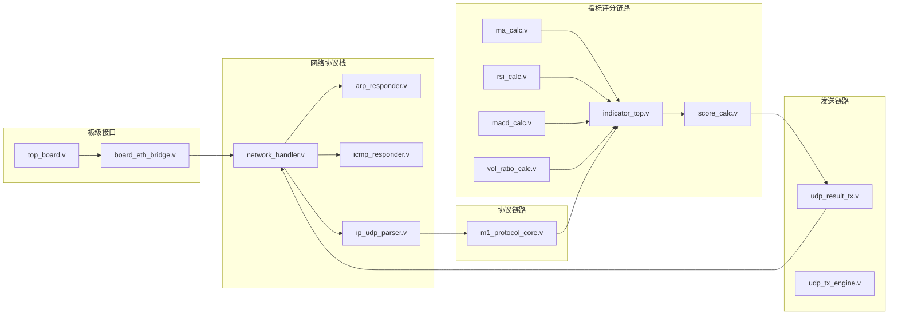

# FPGA 模块详细设计（落地实现版）

版本：V2.2  
日期：2026-06-03

## 1. 文档定位

本文件只描述“当前仓库中已经存在并可编译/可仿真”的 FPGA 模块，不再混入纯规划内容。

## 2. RTL 模块地图

## 3. 模块职责与接口要点

### 3.1 network_handler.v（2026-06-03 新增）

职责：

1. 网络协议栈顶层处理器
2. 捕获以太网头（14 字节）
3. 根据 EtherType 分发到不同协议处理器
4. TX 多路复用（优先级：ARP > ICMP > UDP）

关键接口：

- RX：来自 mac_rx 的字节流
- TX：发送到 rgmii_tx_sync 的字节流
- UDP Payload：与应用层交互
- 配置参数：LOCAL_MAC、LOCAL_IP、UDP_DST_PORT

### 3.2 arp_responder.v（2026-06-03 新增）

职责：

1. 响应 ARP 请求
2. 提供 FPGA 的 MAC 地址给 PC

功能：

1. 检测 ARP 请求（opcode = 0x0001）
2. 验证目标 IP 是否为本机 IP
3. 构造 ARP 响应（包含本机 MAC 地址）
4. 计算 FCS（CRC32）

配置参数：

- `LOCAL_MAC`：本机 MAC 地址（默认 02:00:00:00:00:01）
- `LOCAL_IP`：本机 IP 地址（默认 169.254.0.118）

### 3.3 icmp_responder.v（2026-06-03 新增）

职责：

1. 响应 ICMP Ping 请求
2. 方便测试网络连通性

功能：

1. 检测 ICMP Echo Request（type = 8）
2. 验证目标 IP 是否为本机 IP
3. 存储 ICMP payload（最多 256 字节）
4. 构造 ICMP Echo Reply
5. 计算 IP 头校验和

### 3.4 m1_protocol_core.v

职责：

1. 解析上行 48B 帧
2. 校验 `header/length/crc`
3. 决定接收或拒绝
4. 生成协议回包路径需要的控制信号

关键观测：

- `frame_accepted`
- `frame_rejected`
- `frame_reject_reason`（1=header，2=length，3=crc，4=size）

### 3.5 indicator_top.v

职责：

1. 接收行情输入
2. 汇聚 MA/RSI/MACD/量比输出
3. 形成统一指标输出给评分模块

### 3.6 score_calc.v

职责：

1. 基于指标计算综合评分
2. 输出离散决策等级

### 3.7 udp_result_tx.v

职责：

1. 组织结果帧字段
2. 按字节输出发送流
3. 通过 `tx_valid` / `tx_last` 指示帧边界

### 3.8 udp_tx_engine.v

职责：

1. 构造完整的以太网/IPv4/UDP 帧
2. 计算 IP 头校验和
3. 计算 FCS（CRC32）
4. 插入前导码和 SFD

### 3.9 board_eth_bridge.v

职责：

1. 板级以太网桥接
2. 实例化网络处理器和 PHY 接口
3. 管理 CDC FIFO
4. 提供调试输出

### 3.10 top.v

职责：

1. 统一挂接指标、评分、发送模块
2. 对外输出联调与观察信号
3. 作为系统级 TB 的主入口

### 3.11 top_stub.v

用途：最小占位顶层，保留兼容性，不作为主联调入口。

## 4. Testbench 覆盖

| TB 文件 | 关注点 |
|---|---|
| tb_score_calc.sv | 评分与决策映射 |
| tb_indicator_top.sv | 指标链路输出 |
| tb_udp_result_tx.sv | 打包字节流行为 |
| tb_top.sv | 统一 top 联调 |
| tb_top.v（tb_m1_protocol_core） | 协议核收发与校验 |
| tb_system_mixed.sv | 好帧/坏帧混合压力 |

## 5. 仿真脚本

### run_xsim.tcl

用途：按清单批量执行多个 TB。

### run_single_tb.tcl

用途：单 TB 独立执行，推荐用于排障和日志归档。

## 6. 关键实现说明

1. `rsi_calc.v` 已采用中间量写法规避 Vivado 对表达式切片的解析问题。
2. 协议核与指标链路目前是“并存”状态，便于分别验收。
3. 默认仿真窗口有限，系统级 verdict 需按 TB 特性延长运行时间。

## 7. 下一步建议

1. 将评分阈值参数化并形成可配置接口。
2. 增加长时混合流量 TB，自动统计拒绝原因分布。
3. 对 `udp_result_tx` 增加帧字段一致性断言。

