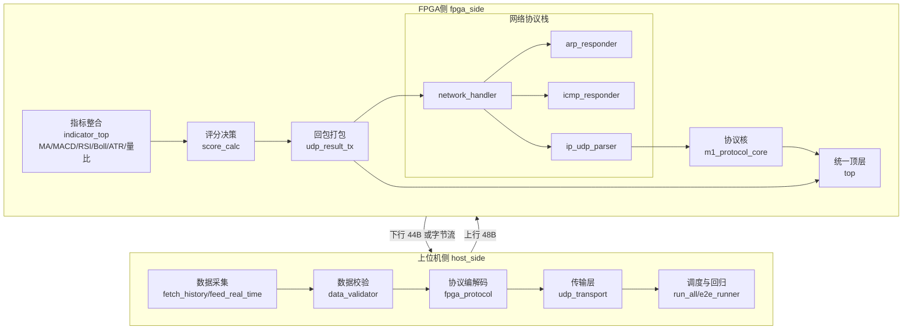

# 系统总体架构设计（统一闭环版）

文档编号：FPGA-QT-02-001  
版本：V2.2  
日期：2026-06-03

## 1. 文档目标

用一份文档同时回答三个问题：

1. 当前代码到底已经实现到哪里
2. 上位机与 FPGA 的闭环路径是什么
3. 下一阶段应该在什么基础上迭代

## 2. 架构分层

## 3. 当前已落地闭环

### 3.1 协议闭环（稳定）

- 上位机按 ICD 生成 48B 上行帧
- FPGA `m1_protocol_core.v` 完成 header/length/crc 检查
- 错误帧丢弃，且可输出 `frame_reject_reason`
- 成功帧回包 44B 响应

### 3.2 指标闭环（已接入）

- `top.v` 集成 `indicator_top.v` + `score_calc.v` + `udp_result_tx.v`
- 指标模块包括 `ma_calc.v`（MA5/MA20/MA60）、`rsi_calc.v`、`macd_calc.v`（DIF/DEA）、`vol_ratio_calc.v`，以及 Bollinger 上下轨和 ATR
- 系统时钟：50MHz（`sys_clk_50m`）
- TB 已可运行并输出关键观测值

### 3.3 网络协议栈（2026-06-03 新增）

FPGA 现在实现了完整的网络协议栈：

1. **ARP 响应器** (`arp_responder.v`)
   - 响应 PC 的 ARP 请求
   - 提供 FPGA 的 MAC 地址
   - 这是 PC 能够发送 UDP 包到 FPGA 的关键

2. **ICMP Ping 响应器** (`icmp_responder.v`)
   - 响应 ping 请求
   - 方便测试网络连通性
   - 支持存储和回显 ICMP payload

3. **网络处理器** (`network_handler.v`)
   - 集成 ARP、ICMP、UDP 处理
   - 以太网头解析和协议分发
   - TX 多路复用（优先级：ARP > ICMP > UDP）

4. **网络配置**
   - FPGA IP: 169.254.0.118
   - PC IP: 169.254.0.100（必须在同一子网）
   - UDP 端口: FPGA 5001 ↔ PC 5000

### 3.4 当前限制

- 部分系统级 TB 默认 1000ns，可能不足以打印最终 PASS/FAIL 行
- 指标精度与参数仍需按业务需求继续标定
- 网络协议栈需要实机验证

## 4. 当前与目标的关系

| 维度 | 当前状态 | 目标状态 |
|---|---|---|
| 协议正确性 | 已稳定 | 保持 |
| 指标链路 | 已接入并可仿真 | 精度收敛 + 实机验证 |
| 评分决策 | 已有基础规则 | 参数化与策略联动 |
| 实机闭环 | 部分验证 | 持续运行与观测自动化 |

## 5. 工程边界与职责

### 上位机侧职责

1. 输入数据的可得性与质量控制
2. 协议编解码一致性
3. 传输稳定性与重试统计
4. 测试和日志产物归档

### FPGA 侧职责

1. 严格执行协议校验
2. 完成指标/评分/回包硬件链路
3. 提供可观测调试信号
4. 保证 TB 可重复运行

## 6. 验证策略

1. Python 单元测试：协议/传输/容错
2. RTL 模块 TB：指标、打包、协议核
3. 系统 TB：`tb_top.sv`、`tb_system_mixed.sv`
4. 报告输出：`fpga_side/logs/simulation_result_summary_*.md`

## 7. 阅读顺序建议

1. ICD
2. 数据字典
3. Python 模块详细设计
4. FPGA 模块详细设计
5. 本文档（用于整体复盘）

