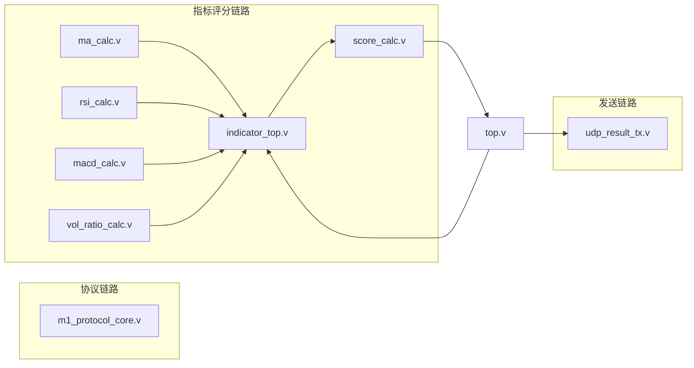

# FPGA 模块详细设计（落地实现版）

版本：V2.1  
日期：2026-05-30

## 1. 文档定位

本文件只描述“当前仓库中已经存在并可编译/可仿真”的 FPGA 模块，不再混入纯规划内容。

## 2. RTL 模块地图

## 3. 模块职责与接口要点

### 3.1 m1_protocol_core.v

职责：

1. 解析上行 48B 帧
2. 校验 `header/length/crc`
3. 决定接收或拒绝
4. 生成协议回包路径需要的控制信号

关键观测：

- `frame_accepted`
- `frame_rejected`
- `frame_reject_reason`（1=header，2=length，3=crc，4=size）

### 3.2 indicator_top.v

职责：

1. 接收行情输入
2. 汇聚 MA/RSI/MACD/量比输出
3. 形成统一指标输出给评分模块

### 3.3 score_calc.v

职责：

1. 基于指标计算综合评分
2. 输出离散决策等级

### 3.4 udp_result_tx.v

职责：

1. 组织结果帧字段
2. 按字节输出发送流
3. 通过 `tx_valid` / `tx_last` 指示帧边界

### 3.5 top.v

职责：

1. 统一挂接指标、评分、发送模块
2. 对外输出联调与观察信号
3. 作为系统级 TB 的主入口

### 3.6 top_stub.v

用途：最小占位顶层，保留兼容性，不作为主联调入口。

## 4. Testbench 覆盖

| TB 文件 | 关注点 |
|---|---|
| tb_score_calc.sv | 评分与决策映射 |
| tb_indicator_top.sv | 指标链路输出 |
| tb_udp_result_tx.sv | 打包字节流行为 |
| tb_top.sv | 统一 top 联调 |
| tb_top.v（tb_m1_protocol_core） | 协议核收发与校验 |
| tb_system_mixed.sv | 好帧/坏帧混合压力 |

## 5. 仿真脚本

### run_xsim.tcl

用途：按清单批量执行多个 TB。

### run_single_tb.tcl

用途：单 TB 独立执行，推荐用于排障和日志归档。

## 6. 关键实现说明

1. `rsi_calc.v` 已采用中间量写法规避 Vivado 对表达式切片的解析问题。
2. 协议核与指标链路目前是“并存”状态，便于分别验收。
3. 默认仿真窗口有限，系统级 verdict 需按 TB 特性延长运行时间。

## 7. 下一步建议

1. 将评分阈值参数化并形成可配置接口。
2. 增加长时混合流量 TB，自动统计拒绝原因分布。
3. 对 `udp_result_tx` 增加帧字段一致性断言。

