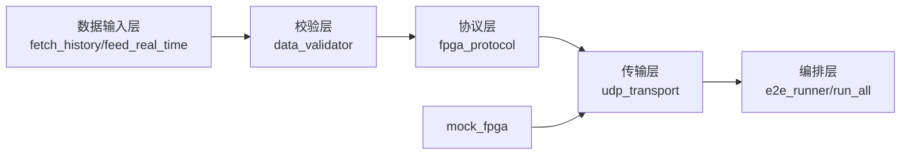

# Python 模块详细设计（主机侧闭环版）

文档编号：FPGA-QT-02-003  
版本：V2.1  
日期：2026-05-30

## 1. 文档目标

给出 `host_side/app` 的模块职责、调用关系和测试映射，确保新同学可在不阅读全部源码的情况下完成上位机侧改造与回归。

## 2. 模块分层



## 3. 模块职责清单

| 文件 | 主要职责 |
|---|---|
| `config.py` | 网络参数、超时、重试等配置项 |
| `fetch_history.py` | 历史分钟数据抓取 |
| `feed_real_time.py` | 实时数据拉取/推送 |
| `data_validator.py` | 数据完整性与取值合法性校验 |
| `indicators.py` | 上位机侧指标基线计算（用于对比） |
| `fpga_protocol.py` | 48B/44B 协议编解码与 CRC32 |
| `udp_transport.py` | UDP 收发、超时与重试控制 |
| `mock_fpga.py` | 本地模拟 FPGA 行为 |
| `e2e_runner.py` | 端到端流程入口 |
| `run_all.py` | 一键执行主流程 |
| `acceptance_injection.py` | 异常注入验收脚本 |

## 4. 调用时序（典型）

1. 获取行情数据（历史或实时）
2. 调用 `data_validator` 过滤异常值
3. `fpga_protocol` 打包为上行帧
4. `udp_transport` 发送并等待响应
5. `fpga_protocol` 解码下行帧
6. `e2e_runner` 汇总结果并输出日志

## 5. 协议一致性要求

1. 字节序固定为 Big-Endian
2. 上行 48B、下行 44B
3. CRC32 计算区间必须与 ICD 一致
4. 字段偏移必须与数据字典一致

## 6. 测试映射

| 测试文件 | 验证目标 |
|---|---|
| `test_protocol.py` | 协议打包/解包正确性 |
| `test_validator.py` | 数据校验规则 |
| `test_udp_transport.py` | UDP 发送与超时重试 |
| `test_run_all_protocol.py` | 主流程协议连通 |
| `test_contract_snapshot.py` | 协议快照一致性 |
| `test_mock_fpga_behavior.py` | mock 行为与异常路径 |

执行命令：

```powershell
$env:PYTHONPATH="host_side/app"
python -m unittest -v host_side/tests/test_protocol.py host_side/tests/test_validator.py host_side/tests/test_udp_transport.py host_side/tests/test_run_all_protocol.py host_side/tests/test_contract_snapshot.py host_side/tests/test_mock_fpga_behavior.py
```

## 7. 网络配置参考

参见 `host_side/app/config.py`，关键参数：

```yaml
network:
  local_ip: "192.168.1.100"
  local_port: 5000
  fpga_ip: "192.168.1.101"
  fpga_port: 5001
  timeout: 1.0
  max_retries: 3
data:
  stock_code: "000858.SZ"
  period: "1min"
  history_count: 100
signal:
  rsi_buy_threshold: 30
  rsi_sell_threshold: 70
ui:
  update_interval: 1000    # ms
  show_ma5: true
  show_ma10: true
  show_rsi6: true
  show_rsi14: true
```

## 8. 开发约束

1. 改协议前先改文档（ICD + 数据字典）
2. 改模块必须补对应测试
3. 网络参数统一收敛在 `config.py`
4. 输出日志必须可复现、可追踪

## 9. 下一步建议

1. 增加 FPGA 结果与 Python 指标基线自动对比报告
2. 为 `udp_transport` 增加更细粒度错误统计
3. 将端到端流程拆分为可配置 pipeline
